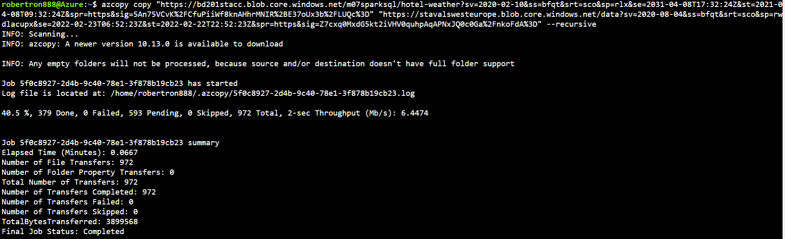
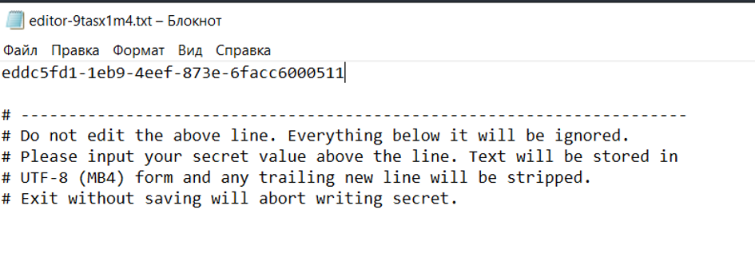
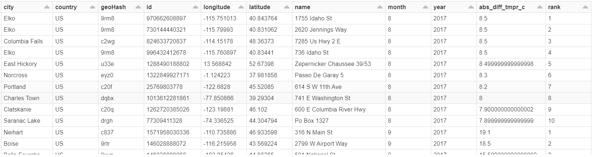
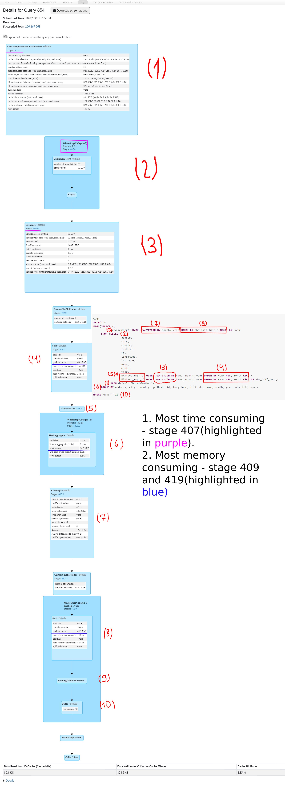
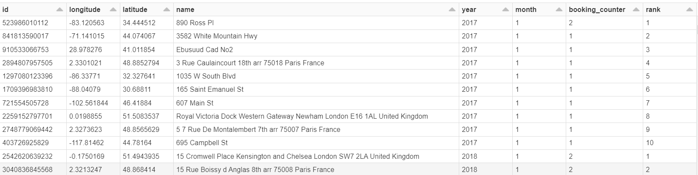
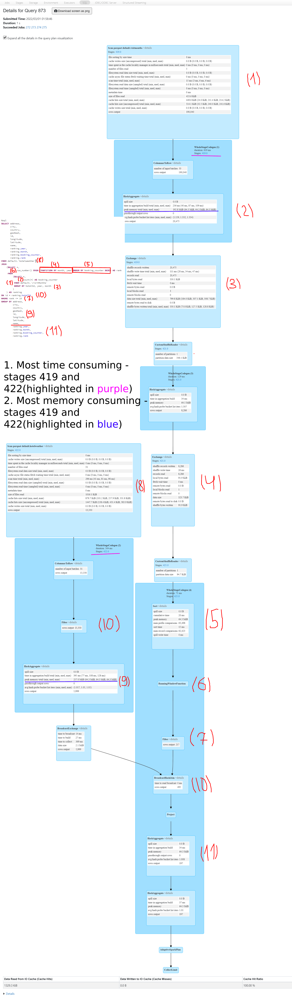
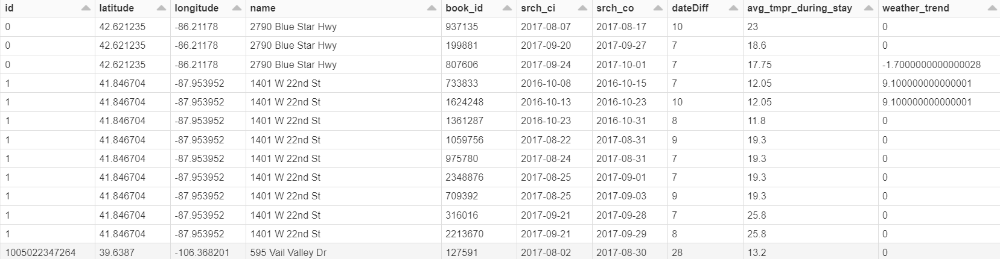
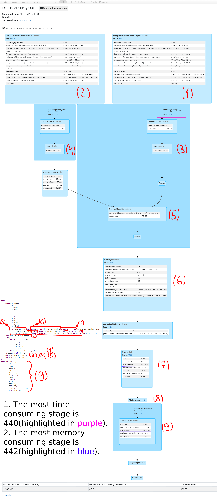
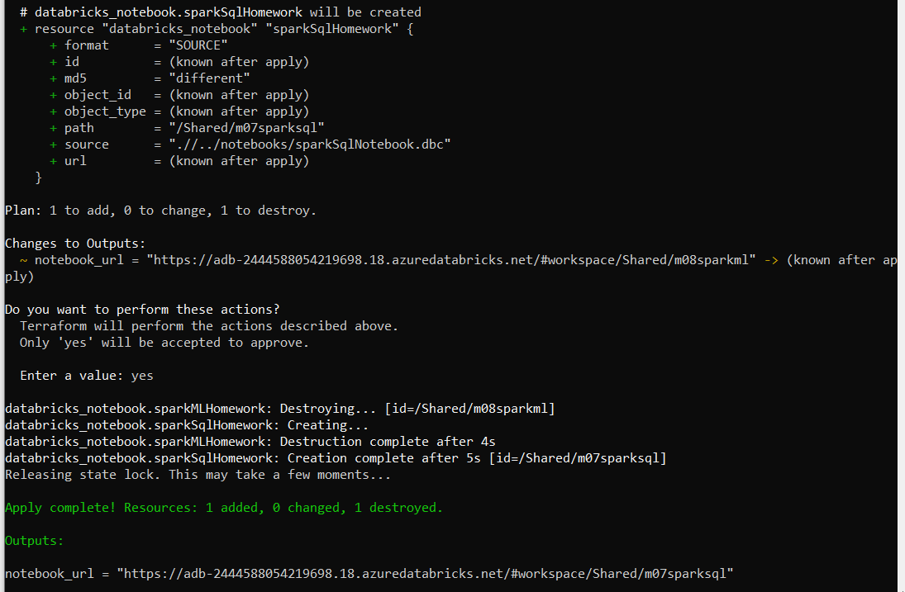

**Copying data to Azure storage**



**Creating secret scope for databricks**

`databricks secrets create-scope --scope sparksql --initial-manage-principal "users"`

**Writing secret to secret scope**

`databricks secret put --scope sparksql --key storagekey`



**Mounting storage with credentials from secret scope**

```scala
val configs = Map(
"fs.azure.account.auth.type" -> "OAuth",
"fs.azure.account.oauth.provider.type" -> "org.apache.hadoop.fs.azurebfs.oauth2.ClientCredsTokenProvider",
"fs.azure.account.oauth2.client.id" -> "8c280f98-faac-441a-aa69-b00a42351332",
"fs.azure.account.oauth2.client.secret" -> dbutils.secrets.get(scope="sparksql",key="storagekey"),
"fs.azure.account.oauth2.client.endpoint" -> "https://login.microsoftonline.com/5dc174ab-3668-4603-a7f3-fa63ad86d976/oauth2/token")

dbutils.fs.mount(
source = "abfss://data@stavalswesteurope.dfs.core.windows.net/",
mountPoint = "/mnt/data",
extraConfigs = configs)
```

**Code for the first query**

```sql
SELECT *
FROM(SELECT *,
            row_number() OVER (PARTITION BY month, year ORDER BY abs_diff_tmpr_c DESC) AS rank 
     FROM (SELECT 
                  address, 
                  city, 
                  country, 
                  geoHash, 
                  id, 
                  longitude, 
                  latitude,
                  name,
                  month, 
                  year,
                  MAX(avg_tmpr_c) OVER (PARTITION BY name, month, year ORDER BY year ASC, month ASC) -
                  MIN(avg_tmpr_c) OVER (PARTITION BY name, month, year ORDER BY year ASC, month ASC) AS abs_diff_tmpr_c
           FROM default.`hotelWeather`)
     GROUP BY address, city, country, geoHash, id, longitude, latitude, name, month, year, abs_diff_tmpr_c
) 
WHERE rank <= 10 
```


**Result of the first query**



**Analysis for the first query execution plan**



**Code for the second query**

```sql
SELECT address, 
       city, 
       country, 
       geoHash, 
       id, 
       longitude, 
       latitude,
       name,
       ranking.year,
       ranking.month,
       ranking.booking_counter,
       ranking.rank
FROM default.`hotelweather`
JOIN
    (SELECT *,
            row_number() OVER (PARTITION BY month, year ORDER BY booking_counter DESC) AS rank
     FROM
         (SELECT *, 
                 count(*) AS booking_counter
          FROM default.`visitMonths`
          GROUP BY hotelId, year, month
         )
    ) AS ranking
ON id = ranking.hotelId
WHERE rank <= 10
GROUP BY address, 
         city, 
         country, 
         geoHash, 
         id, 
         longitude, 
         latitude,
         name,
         ranking.year,
         ranking.month,
         ranking.booking_counter,
         ranking.rank
```

**Result of the second query**



**Analysis for the second query execution plan**



**Code for the third query**

```sql
SELECT *
FROM(
     SELECT address,
            city,
            country,
            geoHash,
            hotels.id AS hotels_id,
            latitude,
            longitude,
            name,
            book.id AS book_id,
            srch_ci,
            srch_co,
            dateDiff,
            AVG(avg_tmpr_c) OVER (PARTITION BY hotels.id, srch_ci, srch_co, book.id  ORDER BY hotels.id ASC) AS avg_tmpr_during_stay,
            FIRST_VALUE(avg_tmpr_c) OVER (PARTITION BY hotels.id, srch_ci, srch_co, book.id ORDER BY hotels.id ASC) -
            LAST_VALUE(avg_tmpr_c) OVER (PARTITION BY hotels.id, srch_ci, srch_co, book.id ORDER BY hotels.id ASC) AS weather_trend
     FROM default.`hotelWeather` AS hotels
     JOIN default.`filteredExpedia` as book
     ON book.hotel_id = hotels.id
     AND wthr_date >= srch_ci
     AND wthr_date <= srch_co
) 
GROUP BY address,
         city,
         country,
         geoHash,
         hotels_id,
         latitude,
         longitude,
         name,
         book_id,
         srch_ci,
         srch_co,
         dateDiff,
         avg_tmpr_during_stay,
         weather_trend
```

**Result of the third query**



**Analysis for the third query execution plan**



Deploying notebook to Databricks with terraform

